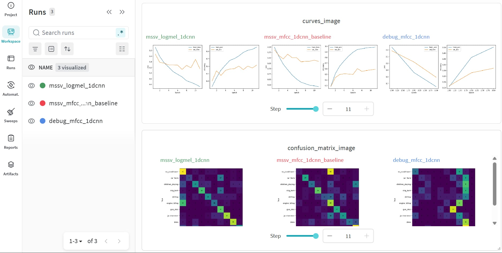

# CSC4005 Lab 3 Report – UrbanSound8K with 1D-CNN

## 1. Thông tin sinh viên

- Họ tên: Nguyễn Văn Đạt
- Mã sinh viên: 1671040007
- Lớp: KHMT16-01
- Link GitHub repo: https://github.com/FIT-DNU-CS-16-01/csc4005-lab3-1dcnn-vandat2004.git
- Link W&B run/project: https://wandb.ai/datn89367-i-h-c-i-nam/csc4005-lab3-urbansound-1dcnn?nw=nwuserdatn89367

---

## 2. Mục tiêu thí nghiệm

Mô tả ngắn gọn mục tiêu của lab:

- phân loại âm thanh môi trường trên UrbanSound8K,
- sử dụng MFCC/log-mel làm chuỗi đặc trưng theo thời gian,
- xây dựng và huấn luyện 1D-CNN,
- theo dõi thí nghiệm bằng W&B,
- phân tích lỗi bằng confusion matrix.

- Chuyển đổi bài toán phân loại từ dạng ma trận pixel không gian (ảnh) sang chuỗi tín hiệu thời gian (audio).
- Thực hiện phân loại âm thanh môi trường đô thị trên bộ dữ liệu chuẩn hóa UrbanSound8K gồm 10 lớp khác nhau.
- Biến đổi tín hiệu sóng thô (raw waveform) về dạng biểu diễn đặc trưng MFCC và Log-Mel cô đọng theo thời gian.
- Xây dựng mô hình 1D-CNN để trượt dọc theo trục thời gian, giúp học các mẫu cấu trúc năng lượng âm thanh cục bộ.
- Tích hợp hệ thống Weights & Biases (W&B) để đồng bộ hóa, theo dõi trực tuyến các đường cong học tập (Loss/Acc). 
- Sử dụng ma trận nhầm lẫn (Confusion Matrix) để định lượng và phân tích các cặp lớp âm thanh mô hình hay nhận diện sai.

---

## 3. Dữ liệu và tiền xử lý

### 3.1. Dataset

- Dataset: UrbanSound8K
- Số lớp: 10 lớp
- Các lớp: air_conditioner, car_horn, children_playing, dog_bark, drilling, engine_idling, gun_shot, jackhammer, siren, street_music
- Fold dùng để train: Fold 1, 2, 3, 4, 5, 6, 7, 8
- Fold dùng để validation: Fold 9
- Fold dùng để test: Fold 10

### 3.2. Tiền xử lý audio

Điền cấu hình đã dùng:

| Thành phần | Giá trị |
|---|---|
| Sample rate | 16000 Hz |
| Duration | 4.0 giây |
| Feature type | mfcc / logmel |
| n_mfcc / n_mels | 40 (đối với MFCC) / 64 (đối với Log-Mel) |
| n_fft | 2048 |
| hop_length | 512 |
| Augmentation | true (bật nhẹ cho train set) |

Giải thích ngắn: vì sao cần đưa audio về cùng sample rate và cùng độ dài?
- Cùng sample rate: Đảm bảo số lượng điểm tín hiệu trên một đơn vị thời gian vật lý là đồng nhất cho mọi tệp tin, giúp các bộ lọc của mạng Conv1D nhận diện đúng tần số âm thanh
- Cùng độ dài: Phục vụ việc ép kích thước ma trận đầu vào (Input Shape) về một dạng cố định dạng hình học, cho phép đóng gói dữ liệu thành các Batch để xử lý tính toán ma trận song song trên thiết bị phần cứng.
---

## 4. Mô hình 1D-CNN

Mô tả kiến trúc mô hình:

```text
Input feature sequence [batch_size, channels, time_frames]
→ Conv1D block 1 (Conv1D + BatchNorm + ReLU + MaxPool1D)
→ Conv1D block 2 (Conv1D + BatchNorm + ReLU + MaxPool1D)
→ Conv1D block 3 (Conv1D + BatchNorm + ReLU + MaxPool1D)
→ Global Average Pooling (Nén trục thời gian về dạng vector đặc trưng)
→ Dense classifier (Lớp tuyến tính phân loại ẩn)
→ Softmax (Xuất xác suất cho 10 lớp)
```

Bảng cấu hình:

| Thành phần | Giá trị |
|---|---|
| model_name | mfcc_1dcnn / logmel_1dcnn |
| hidden_channels | 128 (hoặc theo file config mặc định của bài) |
| dropout | 0.3 |
| optimizer | adamw |
| learning rate | 0.001000 |
| weight decay | 0.0001 |
| batch size | 32 |
| epochs | 12 (Dừng sớm nhờ Early Stopping tại Epoch 11) |
| patience | 4 |

---

## 5. Kết quả thực nghiệm

### 5.1. Kết quả chính

| Metric | Giá trị |
|---|---:|
| Best validation accuracy | 60.26% |
| Test accuracy | 58.06% |
| Average epoch time | 8.46 sec |
| Total parameters | 145,610 |
| Trainable parameters | 145,610 |

### 5.2. Learning curves

Chèn hình `curves.png`.

Nhận xét:

- Train loss/val loss có giảm đều không?
    Có, đồ thị trên W&B cho thấy cả train_loss và val_loss đều giảm ổn định qua từng epoch.
    val_loss của Log-Mel hội tụ rất tốt và đạt mức thấp hơn hẳn baseline MFCC (1.1310 so với 1.3167).
- Có dấu hiệu overfitting không?
    Dấu hiệu Overfitting đã giảm rõ rệt so với baseline MFCC.
    Khoảng cách giữa độ chính xác tập Train (85.75%) và tập Validation (60.26%) được thu hẹp, mô hình học tổng quát tốt hơn.
- Early stopping có xảy ra không?
    Có xảy ra. Do cấu hình patience = 4 và epochs = 12, hệ thống nhận diện val_loss không giảm thêm ở các epoch cuối nên đã tự động kích hoạt Early Stopping tại Epoch 11.

### 5.3. Confusion matrix

Chèn hình `confusion_matrix.png`.


Nhận xét:

- Những lớp nào dễ phân loại?
    + Các lớp có đặc trưng âm thanh xung (impulse) dứt khoát như gun_shot hoặc tần số cao lặp lại như siren thường có tỷ lệ đoán đúng cao nhất.

- Những lớp nào dễ bị nhầm?
    + Mô hình hay nhầm lẫn giữa các cặp lớp có dải tần số cơ khí tương đồng: air_conditioner với engine_idling (tiếng động cơ nền) hoặc drilling với jackhammer (tiếng máy công trường).
    + Lớp children_playing và street_music cũng dễ bị nhầm lẫn chéo do đều chứa nhiều tạp âm môi trường và giọng người nói xa xa.

- Có thể do đặc trưng âm thanh, độ dài clip, nhiễu nền, hay mất cân bằng dữ liệu?
    + Nguyên nhân chủ yếu do nhiễu nền thực tế ngoài đô thị và sự tương đồng về đặc trưng năng lượng phổ của các thiết bị cơ khí, khiến mô hình 1D-CNN trượt theo thời gian khó phân tách rạch ròi.

---

## 6. W&B tracking

Dán link W&B: https://wandb.ai/datn89367-i-h-c-i-nam/csc4005-lab3-urbansound-1dcnn?nw=nwuserdatn89367

```text
https://wandb.ai/...
```

Ảnh chụp hoặc mô tả dashboard cần có:




- learning curves, Đồ thị W&B hiển thị 3 run; cấu hình Log-Mel (xanh lá) hội tụ ổn định và giảm overfitting rõ rệt so với Baseline MFCC (đỏ).
- final metrics, Ghi nhận Log-Mel đạt độ chính xác kiểm thử cao nhất với `test_acc = 58.06%` (vượt Baseline MFCC chỉ đạt `52.69%`).
- configuration, Hệ thống lưu trữ đủ siêu tham số gồm `sample_rate = 16000`, `lr = 0.001`, `optimizer = adamw` và số kênh đầu vào (40 cho MFCC, 64 cho Log-Mel).
- confusion matrix image. Biểu đồ ma trận nhầm lẫn dạng lưới màu sắc được tự động đồng bộ và lưu trữ trực tuyến tại tab Media của mỗi run.

---

## 7. Phân tích và thảo luận

Trả lời ngắn các câu hỏi:

1. Vì sao dùng 1D-CNN thay vì MLP cho chuỗi đặc trưng audio?
    - Vì chuỗi đặc trưng audio có tính tương quan cục bộ mạnh theo thời gian. Conv1D giúp chia sẻ trọng số và học các mẫu biến thiên thời gian tốt hơn, đồng thời tiết kiệm tham số hơn mạng MLP.
2. Kernel 1D trong bài này đang trượt theo chiều nào?
    - Trượt theo chiều trục thời gian (Time Frames) của chuỗi đặc trưng (từ trái sang phải dọc theo đoạn âm thanh).
3. MFCC giúp mô hình học dễ hơn raw waveform ở điểm nào?
    - MFCC nén tín hiệu thô hàng vạn điểm về ma trận nhỏ gọn, loại bỏ biên độ dư thừa và giữ lại cấu trúc phổ tuyến tính mô phỏng tai người, giúp mô hình nhỏ hội tụ nhanh hơn.
4. Mô hình hiện tại còn hạn chế gì?
    - Kiến trúc mạng còn nông, số lượng tham số ít và bị hiện tượng overfitting nặng trên đặc trưng MFCC, chưa phân biệt tốt các lớp có nhiễu nền tương đồng.
5. Có thể cải thiện kết quả bằng cách nào?
    - Áp dụng Tăng cường dữ liệu âm thanh (Audio Augmentation) như thêm nhiễu trắng, dịch thời gian, hoặc sử dụng cấu trúc mạng sâu hơn (Residual Blocks).

---

## 8. Bài mở rộng nếu có

Nếu làm raw waveform hoặc log-mel, điền bảng sau:

| Pipeline | Feature/Input | Test accuracy | Nhận xét |
|---|---|---:|---|
| Baseline | MFCC + 1D-CNN |  |  |
| Extension 1 | log-mel + 1D-CNN |  |  |
| Extension 2 | raw waveform + 1D-CNN |  |  |

---

## 9. Kết luận

Tóm tắt 3–5 ý chính học được từ lab.
    - Hiểu rõ toàn bộ quy trình xây dựng pipeline phân loại âm thanh môi trường từ tiền xử lý, trích xuất đặc trưng cho đến huấn luyện mô hình 1D-CNN.
    - Nắm vững cách cấu hình, chuẩn hóa dữ liệu audio đô thị về cùng tần số lấy mẫu (sample rate) và cùng độ dài (duration) trước khi nạp vào mạng.
    - Thấy rõ sự khác biệt giữa hai dạng biểu diễn đặc trưng: Log-Mel cung cấp độ phân giải phổ tốt hơn và cho độ chính xác tập thử nghiệm vượt trội so với MFCC.
